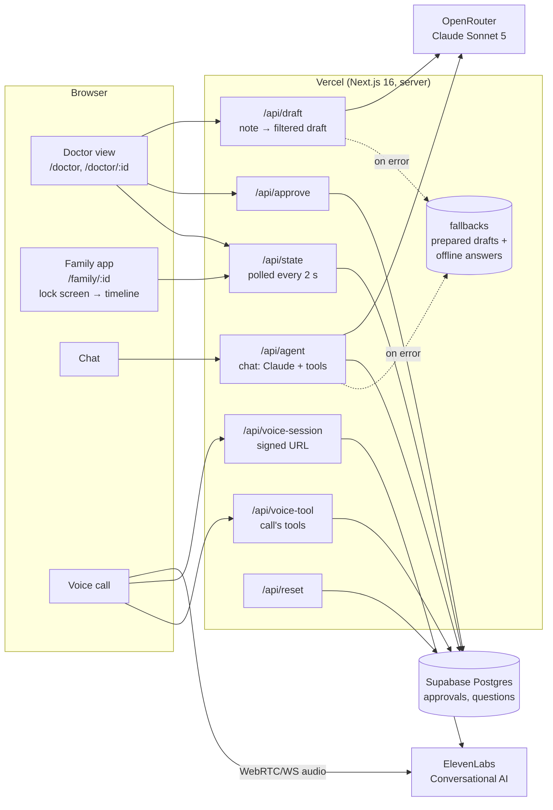

# Architecture

> Source of truth for the technical setup. **Agents: update this file (and the status column) whenever you add or change a route, table, tool or service.**
> Last verified: 2026-09-26 14:40 (all services green on `/status`, full demo path tested on production).

## Overview

MindPeace is a single Next.js app on Vercel with two screens: the **doctor view** (desktop) and the **family app** (a phone-sized window that starts on an iPhone lock screen). The browser never holds a secret key. All AI and voice calls go through our own API routes, and **every AI path has a fallback**, so the live demo can't crash.



## Demo flow (what calls what)

1. **Start page and ward overview** prepare today's drafts in the background (`DraftWarmup`), like a daily job would. `/api/draft` caches live drafts in the `drafts` table, so the review screen opens instantly; it still shows the loading steps for ~3.6 s so the audience sees what the AI does.
2. **Review** (`/doctor/maria`): `/api/draft` → `generateDraft()` sends the chart note + its numbered PLAN items to Claude. Claude returns `today`/`next` lists, `withheld` items and a `planSkipped` list. The server checks that **every plan item** is covered, retries once if not, and falls back to a prepared draft if the AI fails.
3. Doctor toggles/edits items → **Approve update** → `/api/approve` writes to `approvals` (only switched-on items).
4. **Family app** polls `/api/state` every 2 s. A new approval → iOS-style **push notification** on the lock screen 1.5 s later → tap → timeline with the new day highlighted.
5. **Chat** → `/api/agent`: Claude tool runner with `get_approved_update`, `get_ward_info`, `log_question_for_doctor`, `book_callback_slot`.
6. **Call** → `/api/voice-session` returns a short-lived signed URL → the browser talks to the **ElevenLabs agent** directly. Its client tools (`get_approved_update`, `get_ward_info`, `pass_question_to_doctor`) run in our app via `/api/voice-tool`, so the voice agent only ever sees approved data.
7. Logged questions show up on the doctor's review screen (with the booked callback) and as a badge in the ward overview.

## Components

| Part | File(s) | What it does | Status |
|---|---|---|---|
| AI client | `src/lib/ai.ts` → `askClaude()`, `getClient()` | OpenRouter (Anthropic-compatible endpoint) when `OPENROUTER_API_KEY` is set, else Anthropic directly. Timeout + cached fallback | ✅ live |
| Draft filter | `src/lib/draft.ts`, route `src/app/api/draft` | Chart note → family draft. Rules mirror what nurses may say (`docs/research/nurse-input.md`). Plan-coverage check + retry + prepared fallback | ✅ live |
| Approvals & state | `src/lib/store.ts`, routes `approve`, `state`, `reset` | Seed approvals (past days) + live rows in Supabase. In-memory fallback without Supabase env | ✅ live |
| Chat agent | `src/app/api/agent/route.ts`, `src/lib/agent-tools.ts` | Claude tool runner, returns answer + `events` (shown as chips) | ✅ live |
| Offline chat | `src/lib/offline-agent.ts` | No AI → answers from approved data; medical questions still logged with a callback | ✅ |
| Voice call | `src/components/family/call-screen.tsx`, routes `voice-session`, `voice-tool`, agent config `scripts/create-voice-agent.ts` | ElevenLabs Conversational AI (Claude as LLM), real-time, client tools, voice-reactive wave | ✅ live |
| Doctor view | `src/app/doctor/*`, `src/components/doctor/*` | Ward overview (22 beds), review screen (note ↔ editable draft, withheld panel, family questions), one-click "New radiology report" for the judge demo | ✅ live |
| Family app | `src/app/family/[id]`, `src/components/family/*` | Lock screen + push, status headline, day chips, "why she's here", timeline to expected discharge, care team section, call + chat buttons | ✅ live |
| Seed data | `src/data/seed.ts`, `src/data/notes.ts` | Hospital, doctor, 3 real patients + 19 static beds, past approvals, today's chart notes. **Synthetic only** | ✅ |
| Fallbacks | `src/data/fallback-drafts.ts`, `src/data/fallbacks.ts` | Prepared drafts per patient (+ judge-trick variant), generic voice answers | ✅ |
| Design system | `DESIGN.md`, tokens in `src/app/globals.css`, `src/components/brand.tsx` | Poppins, mint canvas, teal for actions, coral only for withheld, pills, soft shadows | ✅ |
| Health check | `src/app/status/page.tsx` | 🟢/🔴 per service (checks keys exist + Supabase reachable) | ✅ |

## Database (Supabase, project `qwuswyylymbwzdrqhjpk`)

| Table | Columns | Notes |
|---|---|---|
| `approvals` | `patient_id`, `day`, `update` (jsonb `FamilyUpdate`), `approved_by`, `approved_at` | Today's approvals. Past days come from seed data |
| `questions` | `patient_id`, `question`, `asked_by`, `callback_slot`, `created_at` | Logged by chat or call |
| `drafts` | `note_hash` (sha256 of patient + note), `patient_id`, `update`, `created_at` | Cache of live AI drafts: a note is drafted once, then served instantly. "Reset demo" keeps it; "Regenerate" bypasses it |

RLS is on with **open demo policies** (anon can read/insert/delete). Fine for synthetic data, not for production.

## Reliability design (why the demo can't crash)

1. **Drafts:** plan-coverage check + one retry; AI failure → prepared draft for that patient (incl. the judge-trick variant).
2. **Chat:** AI failure → `offlineAnswer()` from approved data; medical questions still reach the doctor.
3. **Call:** mic denied or ElevenLabs unreachable → "Call failed, please use the chat".
4. **Draft cache:** drafts are generated once per note and stored in Supabase, so the review screen opens instantly even after reloads.
5. **Reset:** "Reset demo" on the start page clears today's approvals and questions.
6. **Pre-demo check:** `/status` green on the live URL; run the demo once to warm up.

## Services & accounts

| Service | What for | Where configured |
|---|---|---|
| **Vercel** (Hobby) | Hosting, auto-deploy from GitHub `main` | Project `henri-horlitz/skyhack`, domain `mindpeace-health.vercel.app` |
| **GitHub** | Code, private repo | `henrihorlitz/skyhack` |
| **OpenRouter** | Claude for drafts and chat (`anthropic/claude-sonnet-5`) | Key in Vercel env |
| **ElevenLabs** | Voice agent (Conversational AI) + TTS | Agent `ELEVENLABS_AGENT_ID`, created by `scripts/create-voice-agent.ts` |
| **Supabase** | Postgres | Project `qwuswyylymbwzdrqhjpk` ("Skyhack"), eu-west-2 (London) |

## Environment variables

Template: `.env.example`. Local: `.env.local` (gitignored). Production: Vercel env vars (production + preview).

| Variable | Required | Default | Notes |
|---|---|---|---|
| `OPENROUTER_API_KEY` | for live AI | — | Preferred provider when set |
| `OPENROUTER_MODEL` | no | `anthropic/claude-sonnet-5` | Any OpenRouter model id |
| `ANTHROPIC_API_KEY` | alternative | — | Used only when no OpenRouter key |
| `ANTHROPIC_MODEL` / `ANTHROPIC_EFFORT` | no | `claude-opus-5` / `medium` | |
| `AI_TIMEOUT_MS` | no | `25000` | Per request |
| `ELEVENLABS_API_KEY` | for voice | — | Server-side only |
| `ELEVENLABS_AGENT_ID` | for calls | — | From `bun scripts/create-voice-agent.ts` |
| `ELEVENLABS_VOICE_ID` | no | George | |
| `NEXT_PUBLIC_SUPABASE_URL` / `NEXT_PUBLIC_SUPABASE_PUBLISHABLE_KEY` | for DB | — | Public by design. **Never** a secret key here |
| `VERCEL_TOKEN` | local CLI only | — | Not uploaded to Vercel |

Changing a variable on Vercel needs a redeploy to take effect.

## Deploy pipeline

`git push origin main` → Vercel builds → live on `mindpeace-health.vercel.app`.
Manual: `bunx vercel --prod --token "$VERCEL_TOKEN"`. Env var: `printf '%s' "$VALUE" | bunx vercel env add NAME production --token "$VERCEL_TOKEN"`.

## Local development

```bash
bun install
cp .env.example .env.local   # fill in keys
bun run dev                  # http://localhost:3000, then check /status
bun run build                # must pass before pushing
```

## How to extend

- **New chat tool:** add a `betaZodTool` in `makeAgentTools()` (`src/lib/agent-tools.ts`). For the voice call, also add it to `scripts/create-voice-agent.ts`, re-run it with the agent id, and handle it in `/api/voice-tool` + `call-screen.tsx`.
- **New AI feature:** call `askClaude(prompt, system)`. Don't create new SDK clients elsewhere.
- **New patient:** add to `PATIENTS` + `TODAY_NOTES` (+ past approvals and a prepared draft for the fallback).

## Known gotchas

- **`ANTHROPIC_BASE_URL` in Claude Code's shell** would redirect the SDK; `getClient()` pins the base URL.
- **Empty env vars** (`FOO=`) count as unset: use `||`, not `??`, for defaults.
- **The browser pane in the Claude desktop app blocks the microphone**: test calls in Chrome.
- **The very first draft for a note** takes 10–20 s; after that it's cached. Open the start page once before the demo to warm it up.
- **Vercel deployment protection:** generated `*-henri-horlitz.vercel.app` URLs require a login. Share only `mindpeace-health.vercel.app`.
- **Supabase connector is account-wide:** only touch `qwuswyylymbwzdrqhjpk`.
- **Next.js 16** differs from older versions: check `node_modules/next/dist/docs/` (see `AGENTS.md`).
