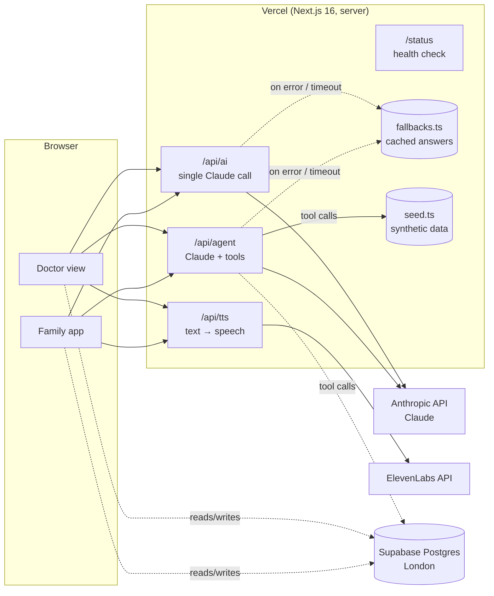

# Architecture

> Source of truth for the technical setup. **Agents: update this file (and the status column) whenever you add or change a route, table, tool or service.**
> Last verified: 2026-09-26 morning (all services green on `/status`, live agent + TTS tested on production).

## Overview

MindPeace is a single Next.js app deployed on Vercel. The browser never talks to an AI or database provider with a secret key. All AI and voice calls go through our own API routes, which hold the keys server-side and **always return something**: if a provider fails, they serve a cached answer, so the live demo can't crash.



## Components

| Part | File(s) | What it does | Status |
|---|---|---|---|
| Single AI call | `src/lib/ai.ts` → `askClaude()`, `src/app/api/ai/route.ts` | One Claude request with timeout, server-side refusal fallback and cached-answer fallback | ✅ live |
| Agent | `src/app/api/agent/route.ts`, tools in `src/lib/agent-tools.ts` | Claude runs a tool-use loop (SDK Tool Runner, max 8 iterations) and returns the answer **plus the list of tool calls** so the UI can show the agent's steps | ✅ live (demo tools) |
| Agent tools (current) | `src/lib/agent-tools.ts` | `lookup_patient`, `find_appointment_slots`, `book_appointment` on seed data | ✅ starter, to be replaced |
| Agent tools (MindPeace) | `src/lib/agent-tools.ts` | `get_approved_update`, `log_question_for_doctor`, `book_callback_slot` | ⬜ planned |
| Voice | `src/app/api/tts/route.ts`, `src/components/speak-button.tsx` | ElevenLabs text-to-speech (`eleven_flash_v2_5`, low latency). Falls back to the browser's built-in voice | ✅ live |
| Fake actions | `src/lib/fake.ts` → `fakeAction()` | Loading toast → success toast, for things we don't build (push, calendar, EHR) | ✅ |
| Seed data | `src/data/seed.ts` | Fixed demo user + synthetic patients. **No real patient data, ever** | ✅ starter, MindPeace notes ⬜ |
| Cached AI answers | `src/data/fallbacks.ts` | Served when the AI call fails; keyed by a word in the input | ✅ generic, real demo answers ⬜ |
| Database client | `src/lib/supabase.ts` → `getSupabase()` | Supabase JS client with the publishable key, no auth. Returns `null` if not configured | ✅ connected, no tables yet |
| Health check | `src/app/status/page.tsx` | 🟢/🔴 per service. Note: Anthropic/ElevenLabs rows only check the key *exists*, not that it's valid | ✅ |
| Doctor view | — | Chart note → briefing (✅ shareable / 🔒 withheld / ✏️ doctor phrases) → approve | ⬜ planned |
| Family app | — | Status pill + timeline + voice agent | ⬜ planned |
| UI kit | `src/components/ui/*` | shadcn/ui on Base UI, Tailwind v4 theme tokens in `src/app/globals.css` | ✅ |

## Reliability design (why the demo can't crash)

1. **Every AI route has a fallback.** No key, timeout (25 s), network error or refusal → cached answer, response marked `source: "fallback"`.
2. **Server-side refusal fallback.** Claude requests send `fallbacks: "default"` (beta `server-side-fallback-2026-07-01`): if a safety classifier declines, Anthropic re-runs the request on a fallback model inside the same call.
3. **Voice degrades gracefully.** ElevenLabs down → browser `speechSynthesis`.
4. **One retry, short timeouts.** `maxRetries: 1` so a hanging provider costs seconds, not minutes.
5. **Pre-demo check:** open `/status` on the live URL; then run the demo path once to warm up.

## Services & accounts

| Service | What for | Where configured |
|---|---|---|
| **Vercel** (Hobby) | Hosting, auto-deploy from GitHub `main` | Project `henri-horlitz/skyhack`, domain `mindpeace-health.vercel.app` |
| **GitHub** | Code, private repo | `henrihorlitz/skyhack` (Vercel GitHub app has access to this repo only) |
| **Anthropic** | Claude (model from `ANTHROPIC_MODEL`, currently `claude-sonnet-5` for speed) | Dedicated workspace "skyhack" with its own spend limit |
| **ElevenLabs** | Text-to-speech | API key with TTS permission |
| **Supabase** | Postgres | Project `qwuswyylymbwzdrqhjpk` ("Skyhack"), region eu-west-2 (London) |

## Environment variables

Template: `.env.example`. Local values: `.env.local` (gitignored). Production: Vercel project env vars (production + preview).

| Variable | Required | Default | Notes |
|---|---|---|---|
| `ANTHROPIC_API_KEY` | for live AI | — | Without it, AI routes serve fallbacks |
| `ANTHROPIC_MODEL` | no | `claude-opus-5` | `claude-sonnet-5` = faster/cheaper |
| `ANTHROPIC_EFFORT` | no | `medium` | `low` / `medium` / `high` |
| `AI_TIMEOUT_MS` | no | `25000` | Per request |
| `ELEVENLABS_API_KEY` | for real voice | — | Without it: browser voice |
| `ELEVENLABS_VOICE_ID` | no | George (`JBFqnCBsd6RMkjVDRZzb`) | |
| `ELEVENLABS_MODEL_ID` | no | `eleven_flash_v2_5` | |
| `NEXT_PUBLIC_SUPABASE_URL` | for DB | — | Public by design |
| `NEXT_PUBLIC_SUPABASE_PUBLISHABLE_KEY` | for DB | — | Public by design. **Never** put the secret/service key in a `NEXT_PUBLIC_` var |
| `VERCEL_TOKEN` | local CLI only | — | Not uploaded to Vercel |

Changing a variable on Vercel needs a redeploy to take effect.

## Deploy pipeline

`git push origin main` → Vercel builds (~20 s) → live on `mindpeace-health.vercel.app`.
Manual: `bunx vercel@latest deploy --prod --token "$VERCEL_TOKEN"`. Update an env var: `printf '%s' "$VALUE" | bunx vercel@latest env add NAME production --force --token "$VERCEL_TOKEN"`.

## Local development

```bash
bun install
cp .env.example .env.local   # fill in keys
bun run dev                  # http://localhost:3000, then check /status
bun run build                # must pass before pushing
```

## How to extend

- **New agent tool:** add a `betaZodTool({ name, description, inputSchema, run })` in `src/lib/agent-tools.ts` and include it in `AGENT_TOOLS`. The description is what Claude reads to decide when to call it, so be specific.
- **New AI feature:** call `askClaude(prompt, system)` from a route. Don't create new Anthropic clients elsewhere.
- **New table:** create it via the Supabase MCP/connector on project `qwuswyylymbwzdrqhjpk` only, then read/write with `getSupabase()`. Keep seed data as a fallback if the DB is empty.
- **Record demo fallbacks:** once the demo path is final, run it live and paste the real answers into `src/data/fallbacks.ts`.

## Known gotchas

- **`ANTHROPIC_BASE_URL` in Claude Code's shell** would redirect the SDK; `getClient()` pins `baseURL` to `https://api.anthropic.com`.
- **Empty env vars** (`FOO=`) count as unset: use `||`, not `??`, for defaults.
- **Anthropic keys must be workspace-scoped**, otherwise the API returns 400 `anthropic-workspace-id`.
- **Vercel deployment protection:** generated `*-henri-horlitz.vercel.app` URLs require a Vercel login. Share only `mindpeace-health.vercel.app`.
- **Vercel Hobby + private repo:** commits by other GitHub users won't deploy.
- **Supabase connector is account-wide:** it can see Henri's other projects. Only touch `qwuswyylymbwzdrqhjpk`.
- **Next.js 16** differs from older versions: check `node_modules/next/dist/docs/` before using unfamiliar APIs (see `AGENTS.md`).
